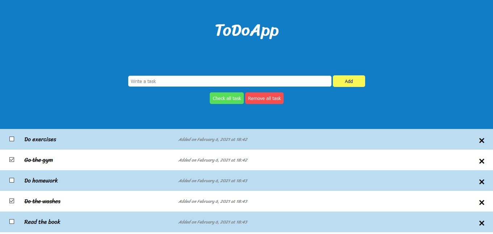

# Todo App

Proyecto del primer modulo de la fase 2. 

Lista ordenadamente cada tarea que ingresa el usuario, las operaciones que se pueden realizar son agregar, eliminar y marcar tareas ademas de marcar las completadas.

---
## Temas abordados de Javascript
* Controles de flujo
* Funciones
* Objectos y arreglos
* Programacion orientada a objetos
* Programacion funcional
* Manipulacion del Dom

---
## Contributors
* PaulinaQuintero
* GuillermoGAndres 
* alejandro28100
* pauvquinterom

